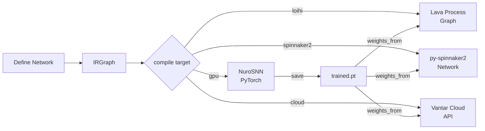

<div align="center">

# Nuro

**Train on GPU. Deploy to neuromorphic silicon. One API.**

[](https://opensource.org/licenses/Apache-2.0)
[](https://www.python.org/downloads/)
[](https://github.com/Vantar-AI/nuro/releases/tag/v0.6.0)
[](#testing)
[](https://vantar.xyz)

</div>

---

## Install

```bash
git clone https://github.com/Vantar-AI/nuro.git && cd nuro
pip install -e ".[gpu,dev]"
```

## Hello Spikes

```python
import nuro

# Define network
inp  = nuro.Population(size=100, dynamics="lif", params={"tau": 20e-3})
out  = nuro.Population(size=10,  dynamics="lif", params={"tau": 10e-3})
conn = nuro.Connection(source=inp, target=out, pattern="dense")
graph = nuro.Graph([inp, out], [conn])

# Compile and run
model = nuro.compile(graph, target="gpu")
model.run(duration=1.0)

print(f"Total spikes: {model.metrics['total_spikes']}")
# You just simulated a spiking neural network.
```

Deploy to Loihi 2 or SpiNNaker 2 with one line change:

```python
model = nuro.compile(graph, target="loihi")     # Intel Loihi 2 via Lava
model = nuro.compile(graph, target="spinnaker2") # SpiNNaker 2 via py-spinnaker2
model = nuro.compile(graph, target="cloud", hardware="loihi")  # Vantar Cloud (v0.7)
```

---

## Why Nuro?

The neuromorphic ecosystem is fragmented. Every framework locks you into one target. Nuro is the abstraction layer that isn't.

| Framework | GPU Training | Loihi Deploy | SpiNNaker | API Quality |
|-----------|-------------|-------------|-----------|-------------|
| **SpikingJelly** | ✓ | ✗ | ✗ | Good |
| **Lava (Intel)** | ✗ | ✓ | ✗ | Verbose |
| **PyNN** | ✗ | Limited | ✓ | Dated |
| **Norse** | ✓ | ✗ | ✗ | Good |
| **Nuro** | **✓** | **✓** | **✓** | **Clean** |

Define once. Train on GPU with surrogate gradients. Recompile to any neuromorphic target — zero code changes.

---

## Performance

Batched simulation on RTX 4090 (1,000-neuron network, 1-second simulation):

| Batch size | Wall time | Throughput | Speedup vs single |
|-----------|-----------|-----------|------------------|
| 1 | 350ms | 5.7M spikes/s | 1× |
| 32 | 347ms | 184M spikes/s | **32×** |
| 128 | 362ms | 707M spikes/s | **124×** |

128 parallel trials in the same time as 1. `model.run(batch_size=128)`.

---

## Supported Hardware

| Target | Backend | Status | Notes |
|--------|---------|--------|-------|
| `"gpu"` | SpikingJelly + PyTorch | **Stable** | Training + surrogate gradients |
| `"loihi"` | Intel Lava | **Stable** (v0.5) | Sim + real hardware (INRC access) |
| `"spinnaker2"` | py-spinnaker2 + Brian2 | **Stable** (v0.6) | Sim + real hardware |
| `"cloud"` | Vantar Cloud API | Beta (v0.7) | Remote compile + deploy |

**Neuron models:** LIF, IF, Izhikevich (5 presets), AdEx
**Connectivity:** Dense, Random Sparse
**Plasticity:** STDP (trace-based), surrogate gradient BPTT

---

## API Examples

### Biologically Realistic Neurons

```python
import nuro

# Izhikevich with firing pattern presets
exc = nuro.Population(size=800, dynamics="izhikevich", params={"preset": "regular_spiking"})
inh = nuro.Population(size=200, dynamics="izhikevich", params={"preset": "fast_spiking"})

# Adaptive Exponential IF
adex = nuro.Population(size=100, dynamics="adex")
```

**Izhikevich presets:** `regular_spiking`, `intrinsically_bursting`, `chattering`, `fast_spiking`, `low_threshold_spiking`

### Train on GPU → Deploy to Silicon

```python
import torch, nuro

# 1. Define network (shared across all backends)
sensory = nuro.Population(size=50, dynamics="lif", params={"tau": 20e-3})
motor   = nuro.Population(size=10, dynamics="lif", params={"tau": 10e-3})
conn    = nuro.Connection(source=sensory, target=motor, pattern="dense")
inp     = nuro.Input(population=sensory, mode="poisson", rate=100.0)
graph   = nuro.Graph([sensory, motor], [conn], inputs=[inp])

# 2. Train on GPU
gpu_model = nuro.compile(graph, target="gpu", requires_grad=True, surrogate="atan")
optimizer = torch.optim.Adam(gpu_model.snn.parameters(), lr=1e-3)
for _ in range(100):
    optimizer.zero_grad()
    out = gpu_model.run(duration=0.1)
    loss = -out[motor.id].sum()
    loss.backward()
    optimizer.step()
    gpu_model.reset()
gpu_model.save("trained.pt")

# 3. Deploy to Loihi (one line)
loihi_model = nuro.compile(graph, target="loihi", weights_from="trained.pt")
loihi_model.run(duration=1.0)
print(loihi_model.metrics)
```

### Recurrent Networks

```python
exc = nuro.Population(size=400, dynamics="lif", params={"tau": 20e-3})
inh = nuro.Population(size=100, dynamics="lif", params={"tau": 10e-3})

conn_ei = nuro.Connection(source=exc, target=inh, pattern="dense")
conn_ie = nuro.Connection(source=inh, target=exc, pattern="dense")

graph = nuro.Graph([exc, inh], [conn_ei, conn_ie])
print(graph.is_cyclic)  # True — Nuro handles recurrence automatically
```

### State Recording

```python
model = nuro.compile(graph, target="gpu")
model.record("voltages", population=motor)
model.record("spikes",   population=motor)
model.record("weights",  connection=conn, interval=100)

model.run(duration=1.0)

v = model.get_state("voltages", population=motor)  # (1000, 10) tensor
s = model.get_state("spikes",   population=motor)  # (1000, 10) tensor
w = model.get_state("weights",  connection=conn)   # (10, 10, 50) snapshots
```

### Batched Simulation

```python
model = nuro.compile(graph, target="gpu")
model.record("spikes", population=motor)

model.run(duration=1.0, batch_size=32)   # 32 parallel trials

spikes = model.get_state("spikes", population=motor)  # (1000, 32, 10)
per_trial = spikes.sum(dim=(0, 2))
print(f"Mean: {per_trial.mean():.0f} spikes  Std: {per_trial.std():.0f}")
```

---

## Architecture

```
┌──────────────────────────────────────────────────────────┐
│  API Layer                                               │
│  Population · Connection · Input · Graph · compile()     │
├──────────────────────────────────────────────────────────┤
│  Intermediate Representation (IR)                        │
│  DynamicsNode · SynapticEdge · IRGraph                   │
├──────────────────────────────────────────────────────────┤
│  Backends                                                │
│  GPU (SpikingJelly) · Loihi (Lava) · SpiNNaker2 · Cloud  │
└──────────────────────────────────────────────────────────┘
```



---

## Examples

| Example | What it shows |
|---------|--------------|
| [`basics/custom_input.py`](examples/basics/custom_input.py) | Static tensors, generators, Poisson inputs |
| [`basics/state_recording.py`](examples/basics/state_recording.py) | Voltages, spikes, weight snapshots |
| [`basics/izhikevich_network.py`](examples/basics/izhikevich_network.py) | Izhikevich presets, AdEx, mixed dynamics |
| [`basics/recurrent_network.py`](examples/basics/recurrent_network.py) | Mutual inhibition, ring circuits |
| [`basics/batched_simulation.py`](examples/basics/batched_simulation.py) | 32 parallel trials, cross-trial analysis |
| [`basics/visualize_spikes.py`](examples/basics/visualize_spikes.py) | Spike raster + voltage trace plots |
| [`training/train_xor.py`](examples/training/train_xor.py) | XOR with surrogate gradients + Adam |
| [`training/mnist_snn.py`](examples/training/mnist_snn.py) | MNIST classification with SNN |
| [`deployment/deploy_to_loihi.py`](examples/deployment/deploy_to_loihi.py) | Train GPU → deploy Loihi 2 |
| [`deployment/deploy_to_spinnaker2.py`](examples/deployment/deploy_to_spinnaker2.py) | Train GPU → deploy SpiNNaker 2 |

---

## Roadmap

| Version | Status | Features |
|---------|--------|----------|
| **v0.1–0.4** | Done | Core API, IR, GPU backend, LIF/IF/Izh/AdEx, STDP, BPTT, batch support |
| **v0.5.0** | Done | Intel Loihi 2 backend (Lava), weight transfer GPU→Loihi |
| **v0.6.0** | **Current** | SpiNNaker 2 backend, custom neurons on Loihi NeuroCores |
| **v0.7.0** | Next | Vantar Cloud — remote compile + deploy to neuromorphic hardware |
| **v1.0.0** | Planned | Stable API, docs site, model zoo |

---

## FAQ

**Q: How is this different from PyNN?**
PyNN is a simulator interface from 2008. Nuro has a modern Python API, gradient training via surrogate functions, and targets current hardware (Loihi 2, SpiNNaker 2). Different goals.

**Q: Do I need neuromorphic hardware?**
No. GPU backend works on any machine with PyTorch. Loihi/SpiNNaker backends fall back to simulators (Lava sim, Brian2). Real hardware is optional.

**Q: Is it suitable for academic research?**
Yes. Apache 2.0 license. State recording, gradient training, and biological neuron models (Izhikevich, AdEx) are all first-class. Cite the repo in your paper.

**Q: Is the API stable?**
Core API (Population, Connection, Graph, compile) is stable from v0.1. We don't break it between minor versions. v1.0 freezes it.

**Q: What is Vantar Cloud?**
A managed API for remote compilation and hardware access. Submit a Nuro graph, run it on Loihi or SpiNNaker without owning the chip. Join the waitlist at [vantar.xyz](https://vantar.xyz).

---

## Testing

```bash
pip install -e ".[gpu,dev]"
pytest tests/ -v
```

121 tests covering the full stack: API, IR, GPU, Loihi, SpiNNaker2, neuron models, recurrence, state recording, checkpoints, batching, gradients, weight transfer.

---

## Vantar Cloud — Early Access

Nuro is open source. Vantar Cloud is the managed platform: submit a network, run it on Loihi 2 or SpiNNaker 2 without hardware access.

**Who it's for:** researchers without INRC access, teams evaluating neuromorphic before committing to hardware.

[**Join the waitlist → vantar.xyz**](https://vantar.xyz)

---

## License

Apache 2.0 — free to use, modify, distribute.

---

<div align="center">

**[Vantar AI](https://vantar.xyz)** · [GitHub](https://github.com/Vantar-AI/nuro) · [Issues](https://github.com/Vantar-AI/nuro/issues) · [Docs](docs/)

</div>
